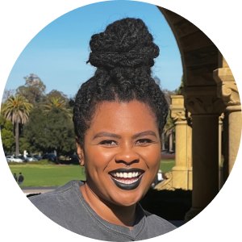

    
     
    <b>LEILENAH MAMEA</b>
     
    Co-founder at Eave Technologies
     
    <a href="https://www.linkedin.com/in/leilenah/">linkedin</a> • <a href="https://github.com/leilenah">github</a> • <a href="https://stanford.slack.com/team/U0394LBT6DS">slack</a>

## About Me

👋🏾 I'm Leilenah - a co-founder of a B2B SaaS startup called Eave Technologies
and a 2nd year MSCS student (HCI track). I took a break in-between undergrad and
grad school to work as a Software Engineer in industry. My strengths are software
development and software project management, but I also enjoy user reasearch and
UX/UI design (hence the HCI specialization 🙂). I'm looking forward to building
something awesome with cool people in this class!

## Work Experience

**Co-founder & Principal Software Engineer**
 
Eave Technologies (current)
 

**Engineering Research Assistant**
 
Stanford University (~6 mos)
 

**Software Engineer**
 
PayPal (~1.5 yrs)
 

**Software Engineer**
 
Amazon (~2 yrs)
 

**Associate Software Engineer**
 
The Walt Disney Company (~2.5 yrs)
 

## Design Projects

•   [Record](https://web.stanford.edu/class/cs147/projects/HarmoniousTies/record/) -
a music-centric journaling app that shows you trends in your emotions over time.
 
•   [Gordon](https://drive.google.com/file/d/1jaOkGKDZEibY_2suYdx_-t2npETgUN4h/view?usp=sharing) -
a virtual cooking assistant that gives you relevant information as you cook.
 
•   [Cardi](https://www.figma.com/file/uZWf40nTUbLTIBsGfjv2E3/Final-Designs?type=design&node-id=0%3A1&mode=design&t=pOvOb96PSBb8TzSr-1) -
A chatbot in Carta that helps students efficiently get information about courses.
