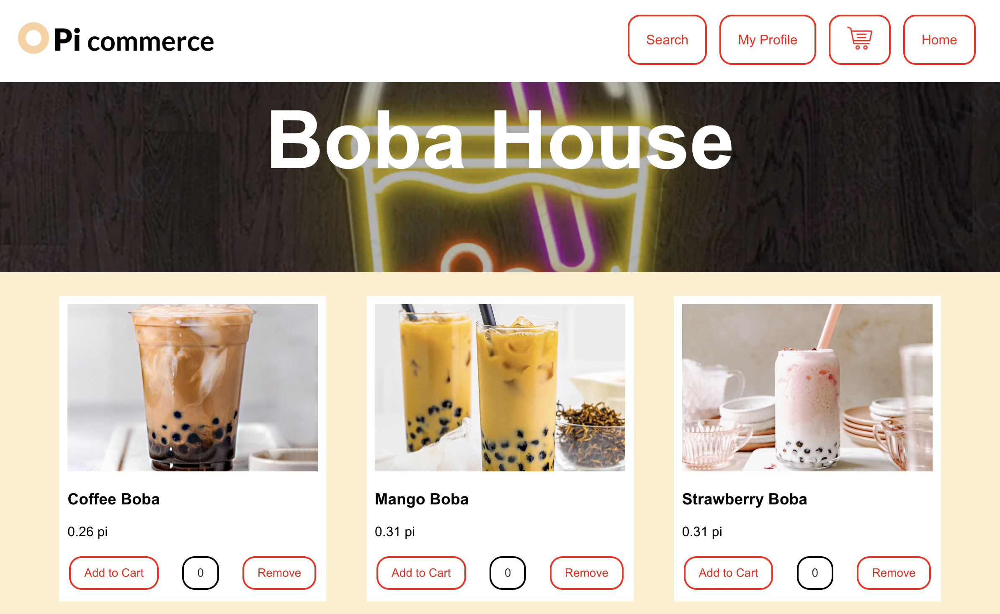
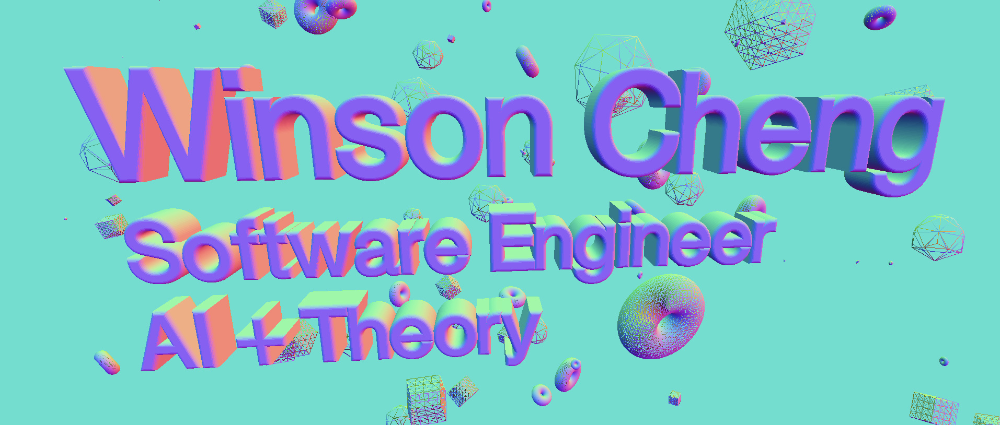

# Winson Cheng - Readme

Hey everyone! I'm Winson, a junior studying CS in the AI/Theory fields. I'm also currently a CS Coterm, but I'm thinking about switching to the MS&E Coterm.

## Skills

| Skill | Experience Level |
|-----:|---------------|
|Python|Advanced|
|C/C++|Intermediate|
|JavaScript|Intermediate|
|HTML/CSS|Intermediate|
|RStudio|Intermediate|
|ReactNative|Intermediate|
|HuggingFace Transformers|Beginner|
|Three.JS/WebGL|Beginner|

## Experiences/Projects

* **Software Engineering Intern, Pi Network**
  * Developing a high-impact web application to deploy to Pi Network’s Web3 app ecosystem in 2024
  * Collaborating with four developers to create an e-commerce app featuring cryptocurrency exchanges
  * Using HTML/CSS/JavaScript, React Native, Figma (Github repo: local-commerce-hub)
  

* **AI Research Assistant, CS 197**
  * Researching how language models can learn to optimize solution-finding using offline RL
  * Instigated research pivot from combining DFS/BFS search trees to exploring search heuristics
  * Experience with Python, Wandb.ai, and training GPT-Neo 1.3B (Github repo: rational-cot)

* **3D Portfolio, Passion Project**
  * Exploring a passion project in which I build a 3D interactive portfolio
  * Using WebGL, ThreeJS, HTML/CSS/JavaScript. Prototype at https://winsonc-portfolio-v0.vercel.app/
  